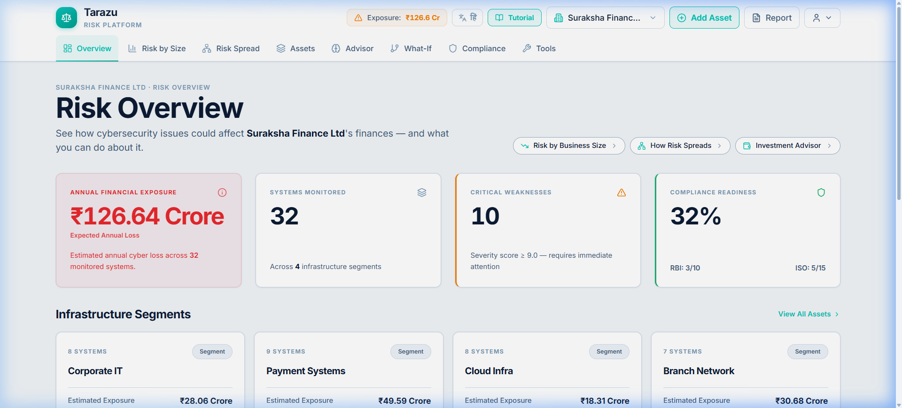
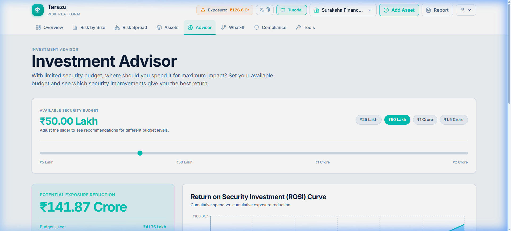
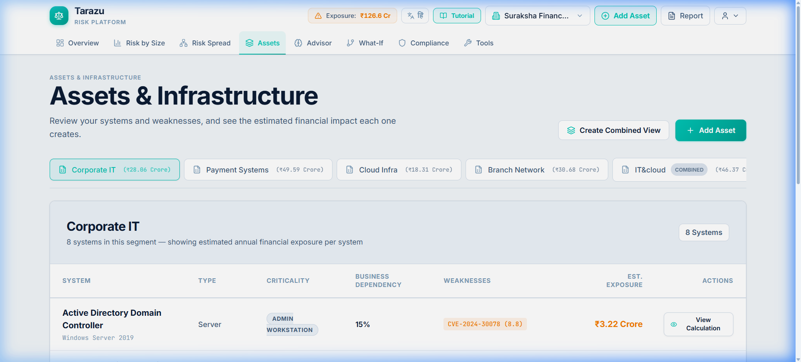
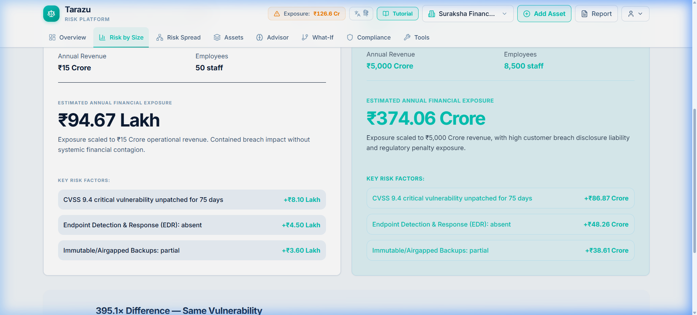

# Tarazu — AI-Powered Cyber Risk Quantification Platform

Tarazu is an advanced Cyber Risk Quantification and Simulation platform that bridges the gap between technical security metrics and business financial risk. It translates CVEs, missing controls, and architectural vulnerabilities into Expected Annual Loss (EAL) and Return on Security Investment (ROSI).

> "Do not invent losses. Calculate them from real architectural dependencies."

## Overview

CISOs and Boards often speak different languages. Tarazu solves this by reading your existing topology and computing precise, cascading financial impacts. It proves that a critical vulnerability on a highly isolated server does not automatically equate to a $10M loss, whereas a medium vulnerability on a core transaction database might.

## Key Features

- **Multi-Organization Scaling:** Instantly switch between massive enterprises and tiny small businesses. The math and UI scale perfectly without breaking.
- **Blast Radius (Impact Map):** A 2D physics-based topology map visualizing how an outage cascades through upstream and downstream assets.
- **What-If Simulation Engine:** A rigorous mathematical simulator that clones the current state, applies changes (e.g., taking an asset offline), and returns the precise financial delta without double-counting shared dependencies.
- **AI Advisor Analytics:** Board-ready charts powered by Recharts, showing Risk Distributions and Financial Exposure concentrations.
- **Intelligent Document Processing:** Upload PDFs or SOC-2 reports to instantly extract missing controls and provision network assets.

## Product Screenshots

### Global Dashboard & KPI Tracking

*The global view showing total Expected Annual Loss, risk distributions, and asset health across the entire organization.*

### AI Security Advisor (Analytics)

*Board-ready charts showing ROSI, Risk Distribution Shifts, and Top 5 Assets by Financial Impact.*

### What-If Scenario Simulator

*Run complex scenarios to see the exact financial delta if an asset goes offline, preventing fictional sequential loss stacking.*

### Intelligent Document Processing

*Extract assets and controls directly from uploaded PDFs and Nmap scans.*

## Documentation

For a deep dive into the platform, please refer to our exhaustive documentation suite located in the `/docs` folder:

- **[Master Context & Handoff](docs/PROJECT_CONTEXT.md)** *(Read this first if you are a new developer or AI agent)*
- **[System Architecture](docs/architecture.md)**
- **[Feature Breakdown](docs/features.md)**
- **[Data Model (ER Diagrams)](docs/data-model.md)**
- **[What-If Simulation Engine](docs/simulation-engine.md)**
- **[Intelligent Document Ingestion](docs/document-ingestion.md)**
- **[Analytics & Blast Radius](docs/analytics-and-impact.md)**
- **[Local Development Guide](docs/development-guide.md)**

## Setup & Running Locally

Please see the [Development Guide](docs/development-guide.md) for full instructions.

**Quick Start:**
1. Backend: `cd backend && pip install -r requirements.txt && python -m uvicorn app.main:app --reload`
2. Frontend: `cd frontend && npm install && npm run dev`
3. Generate Synthetic Data: `cd backend && python scripts/generate_synthetic_docs.py`

## Synthetic Data

Tarazu ships with realistic synthetic data designed for testing document ingestion and processing capabilities. You can find these assets in the `/synthetic-data/` folder at the root of the project.
