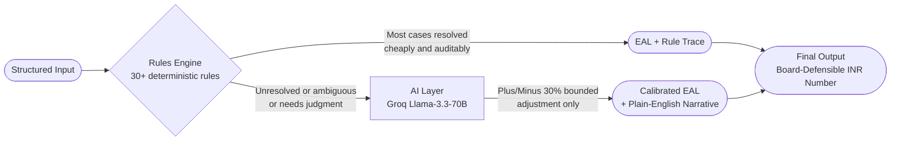
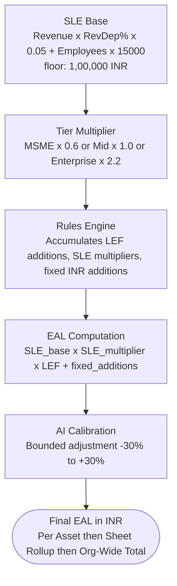
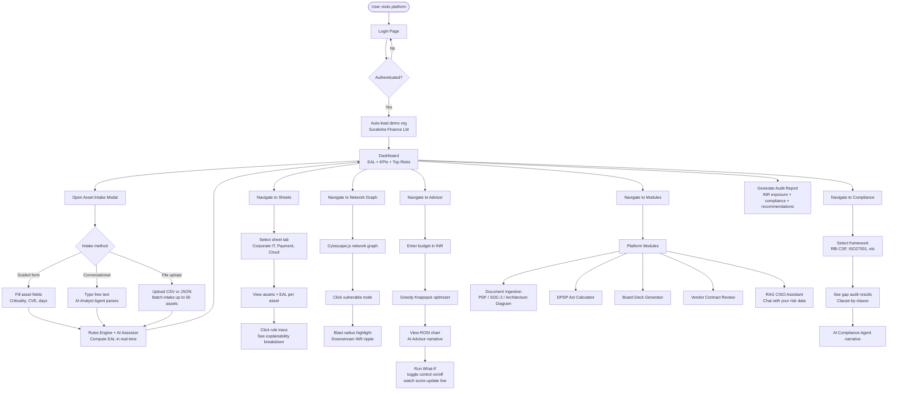
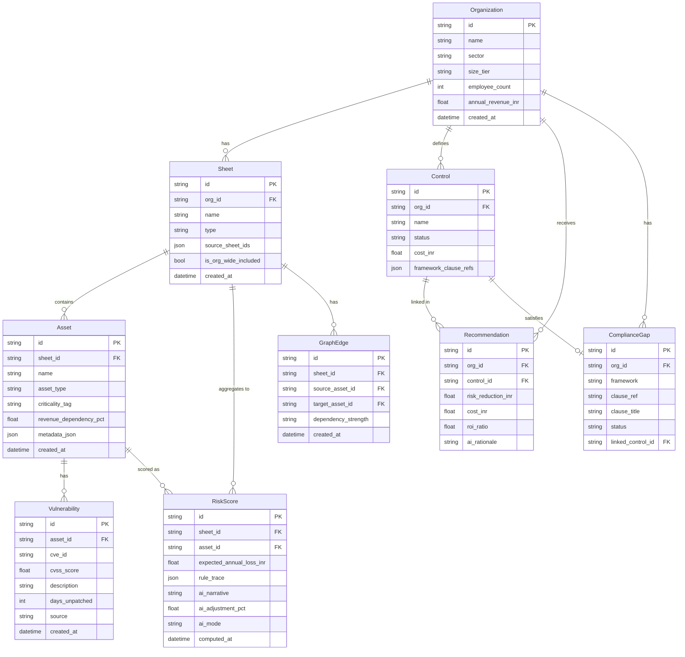
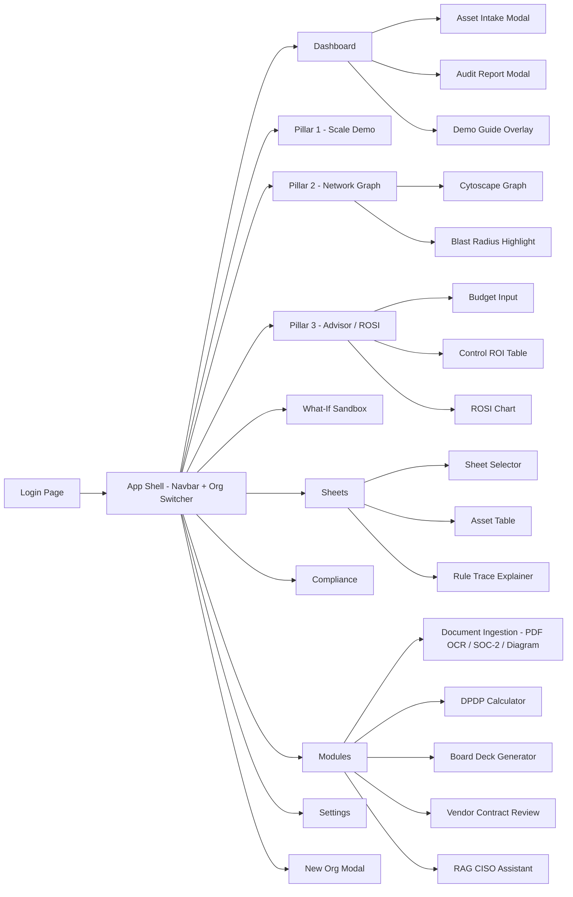
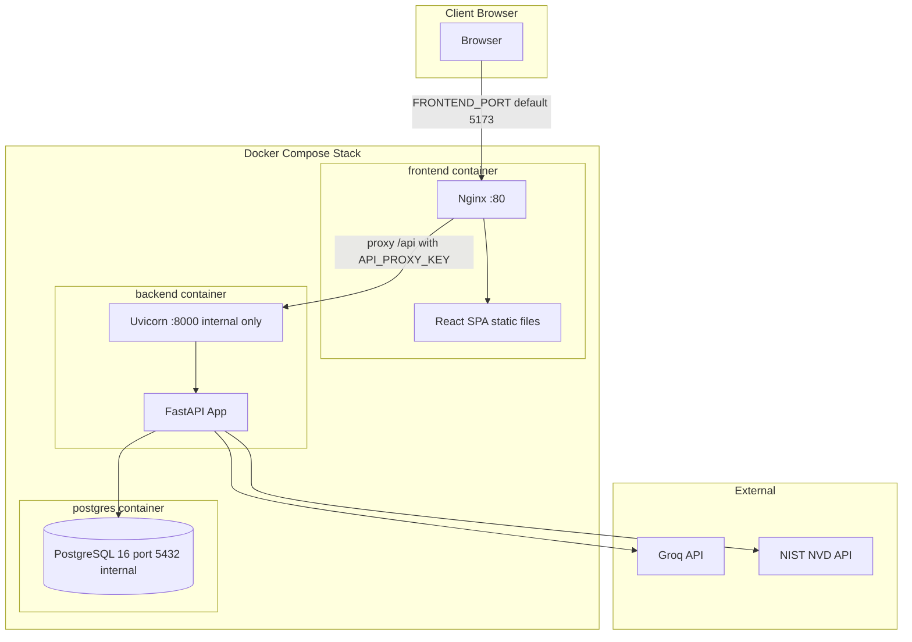

# Tarazu — CyberRiskQuant

> **AI-Powered Continuous Cyber Risk Quantification & Investment Optimization Platform**
> Smart India Hackathon 2026 · SIH26105 · Sponsor: AICTE · Theme: Blockchain & Cybersecurity

[](https://www.sih.gov.in/)
[](https://fastapi.tiangolo.com/)
[](https://react.dev/)
[]()
[](https://www.docker.com/)

---

## What is Tarazu?

**Tarazu** (Hindi: तराज़ू, *scales/balance*) translates vague, qualitative cyber risk labels into **explainable Indian Rupee financial exposure** using a FAIR-calibrated, rules-first quantification engine — so boards, CFOs, and regulators can act on real numbers, not gut feelings.

### Key Differentiators

| Differentiator | Detail |
|---|---|
| India-First | Native support for RBI CSF, SEBI CSCRF, CERT-In directions, DPDP Act 2023 |
| FAIR-Calibrated | EAL = LEF x SLE formula, grounded in IBM India CODB breach-cost data |
| Rules-Before-AI | 30+ deterministic rules resolve most cases; AI calibrates within ±30% bounds |
| Explainable-by-Design | Every rupee figure is traceable to a specific rule + AI narrative — auditor-defensible |
| Scale-Agnostic | Same engine, different outputs for MSME (x0.6) vs. Enterprise (x2.2) |

---

## System Architecture

```mermaid
graph TB
    subgraph "User Layer"
        U["CISO / CFO / Analyst"]
    end

    subgraph "Frontend - React + Vite + TypeScript"
        LP[Login Page]
        NAV[Navbar + Org Switcher]
        DB[Dashboard View]
        P1[Pillar 1 - Scale Demo]
        P2[Pillar 2 - Graph and Blast Radius]
        P3[Pillar 3 - Advisor / ROSI]
        WI[What-If Sandbox]
        SH[Sheets View]
        CO[Compliance View]
        MO[Modules View]
        INT[Asset Intake Modal]
        REP[Audit Report Modal]
    end

    subgraph "Nginx Proxy - Production"
        NX["nginx - /api to backend - Adds API_PROXY_KEY header"]
    end

    subgraph "Backend - FastAPI + SQLAlchemy"
        API_ORG["/api/organizations"]
        API_SH["/api/sheets"]
        API_AS["/api/assets"]
        API_CVE["/api/cve"]
        API_GR["/api/graph"]
        API_OPT["/api/optimization"]
        API_CO["/api/compliance"]
        API_REP["/api/reports"]
        API_MO["/api/modules"]
    end

    subgraph "Service Layer"
        RE["Rules Engine - 30+ rules"]
        AI["Groq AI Service - Llama-3.3-70B"]
        CE["Compliance Engine - 8 Frameworks"]
        COR["Correlation Engine - Graph Topology"]
        OPT["Optimizer - Greedy Knapsack"]
        IE["Intake Engine - NLP + CSV/JSON"]
        NVD["NVD Client - NIST CVE API v2.0"]
        BR["Blast Radius Engine - NetworkX"]
    end

    subgraph "Database Layer"
        SQLITE[("SQLite - Local Dev")]
        PG[("PostgreSQL 16 - Production")]
    end

    subgraph "External APIs"
        GROQ["Groq API - Llama-3.3-70B"]
        NVD_API["NIST NVD API v2.0"]
    end

    U --> LP
    LP --> NAV
    NAV --> DB
    NAV --> P1
    NAV --> P2
    NAV --> P3
    NAV --> WI
    NAV --> SH
    NAV --> CO
    NAV --> MO
    DB --> INT
    DB --> REP

    API_AS --> RE --> AI
    API_AS --> IE
    API_CO --> CE --> AI
    API_SH --> COR --> AI
    API_OPT --> OPT --> AI
    API_GR --> BR
    API_CVE --> NVD

    AI --> GROQ
    NVD --> NVD_API
    RE --> SQLITE
    RE --> PG
```



---

## Rules-Before-AI Engine Design

Every AI component is preceded by a deterministic rules layer that resolves most cases cheaply and auditably. AI is invoked **only for residual complexity**.



---

## FAIR Risk Quantification Formula



---

## User Flow



---

## Data Model



---

## Frontend Navigation Map



---

## Deployment Architecture



### Production deployment

The Docker Compose deployment serves the React application through Nginx. Nginx proxies `/api` to the private backend service and adds the API key on the server side, so browser code never contains the deployment secret.

1. Copy `.env.example` to `.env`.
2. Replace `API_PROXY_KEY` with a long, unique value.
3. Set `API_KEY_TENANTS` as JSON, mapping each key to organization UUIDs. A trusted operator key may use `["*"]`; tenant keys should list only their own organization IDs.
4. Set `GROQ_API_KEY` for AI-assisted mode (omit for rules-only fallback).
5. Start the stack with `docker compose up --build`.

### Local development (no Docker)

For a local-only demo, set `AUTH_REQUIRED=false`.

```text
cd backend && uvicorn app.main:app --reload
cd frontend && npm run dev
```

---

## AI Agents Summary

| Agent | Trigger | Rules First | AI Role |
|---|---|---|---|
| **Analyst Agent** | Asset intake (text / file) | ~20-25 keyword and regex rules | NLP entity extraction, asset normalization |
| **Assessor Agent** | Every asset risk computation | 30+ FAIR rules (R01-R30) | Calibrate ±30%, board-ready narrative |
| **Correlation Agent** | Combined sheet creation | ~20 graph topology rules | Explain compounding vs. naive sum |
| **Advisor Agent** | Investment optimization | Greedy Knapsack math (deterministic) | Explain why control mix maximizes ROSI, flag tradeoffs |
| **Compliance Agent** | Compliance gap evaluation | Clause lookup tables (8 frameworks) | Priority-ordered gap narrative for auditors |

---

## Supported Compliance Frameworks

| Framework | India-Specific |
|---|---|
| ISO 27001 Annex A | — |
| NIST Cybersecurity Framework (CSF) | — |
| CIS Controls | — |
| RBI Cyber Security Framework | Yes |
| SEBI CSCRF | Yes |
| HIPAA | — |
| PCI DSS | — |
| GDPR / DPDP Act 2023 | Yes |

---

## Key Rules Sample

| Rule ID | Trigger | Effect |
|---|---|---|
| R01_CVSS_CRITICAL | CVSS >= 9.0, unpatched >30 days | LEF +45% |
| R04_NO_MFA_ADMIN | MFA absent on admin accounts | LEF +35% |
| R06_NO_BACKUP_AIRGAP | No immutable backups | SLE x1.40 ransomware factor |
| R07_PAYMENT_PROCESSING | Asset tagged payment_processing | Fixed 25L to 1.5Cr penalty |
| R08_CORE_DATABASE | Asset tagged core_db | Fixed 35L to 2Cr penalty |
| R10_SECTOR_BFSI_RBI_COMPLIANCE | BFSI + no PAM | Fixed 15L RBI sanction |
| R12_SECTOR_HEALTHCARE_DPDP | Healthcare + patient data asset | Fixed 20L DPDP Act |
| R29_CERT_IN_6HR_REPORTING | High CVSS + no SIEM | Fixed 10L CERT-In penalty |
| R30_CYBER_INSURANCE_RECOVERY | Cyber insurance present | EAL x 0.65 (35% offset) |

---

## Tech Stack

| Layer | Technology |
|---|---|
| **Frontend** | React 18, TypeScript, Vite, Tailwind CSS v4, Framer Motion, Recharts |
| **Network Graph** | Cytoscape.js |
| **Backend** | Python 3.11+, FastAPI 0.115, SQLAlchemy 2.0 async, Pydantic v2 |
| **Database** | SQLite (local dev) / PostgreSQL 16 (production) |
| **AI** | Groq API (Llama-3.3-70B-Versatile), fallback to rules-only |
| **Graph Algorithms** | NetworkX 3.5 |
| **Auth** | API key scoped per tenant via API_KEY_TENANTS map |
| **Containerization** | Docker + Docker Compose |
| **Web Server** | Nginx (frontend), Uvicorn (backend) |
| **External Data** | NIST NVD API v2.0 (real CVE/CVSS data) |

---

## Verification

```text
cd backend && python test_backend.py
cd frontend && npm run build
```

The backend verification covers the three demo pillars, compliance mapping, and database seeding. The frontend build produces separate on-demand chunks for the graph, advisor, sheets, compliance, and modal views.

---

## Environment Variables

| Variable | Required | Description |
|---|---|---|
| `GROQ_API_KEY` | Optional | Groq API key; omit for rules-only mode |
| `GROQ_MODEL` | Optional | Defaults to llama-3.3-70b-versatile |
| `DATABASE_URL` | Optional | PostgreSQL URL; omit for local SQLite |
| `API_PROXY_KEY` | Production | Key injected by Nginx proxy |
| `API_KEY_TENANTS` | Production | JSON map of key to org_ids list |
| `AUTH_REQUIRED` | Optional | Set false for no-auth local dev |
| `CORS_ORIGINS` | Optional | Comma-separated allowed origins |
| `SEED_ON_STARTUP` | Optional | Defaults true; seeds demo org |

---

## Project Structure

```
SIH_26105/
├── backend/
│   ├── app/
│   │   ├── api/              # FastAPI routers (assets, sheets, compliance, ...)
│   │   ├── services/         # Business logic (rules_engine, ai_service, optimizer, ...)
│   │   ├── models.py         # SQLAlchemy ORM models
│   │   ├── schemas.py        # Pydantic request/response schemas
│   │   ├── config.py         # Env-driven settings
│   │   ├── auth.py           # API key middleware
│   │   ├── database.py       # Async engine + session factory
│   │   └── main.py           # App entry point, router mounting
│   ├── Dockerfile
│   └── requirements.txt
├── frontend/
│   ├── src/
│   │   ├── components/       # React views (dashboard, graph, compliance, ...)
│   │   ├── services/         # Typed API client
│   │   ├── types/            # TypeScript type definitions
│   │   └── App.tsx           # Root with lazy-loading + routing
│   ├── nginx/                # Production Nginx config template
│   ├── Dockerfile
│   └── package.json
├── docs/
│   └── SIH26105_Project_Blueprint.md
├── docker-compose.yml
├── .env.example
└── README.md
```

---

*Tarazu · FAIR-Calibrated · Rules-Before-AI · NIST NVD API v2.0 · SIH 2026 — AICTE Sponsored*
