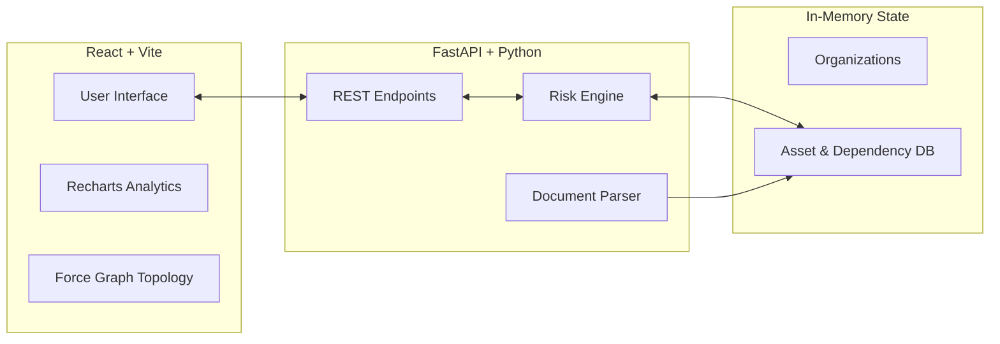
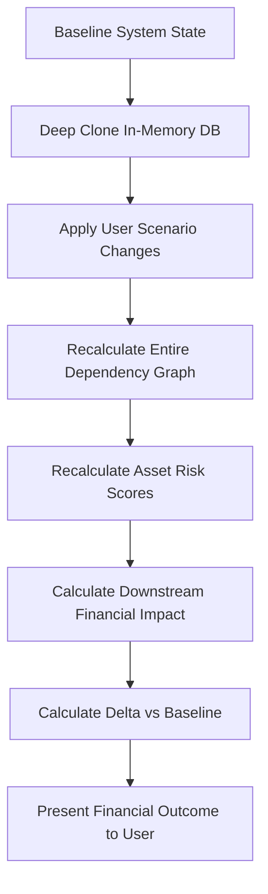
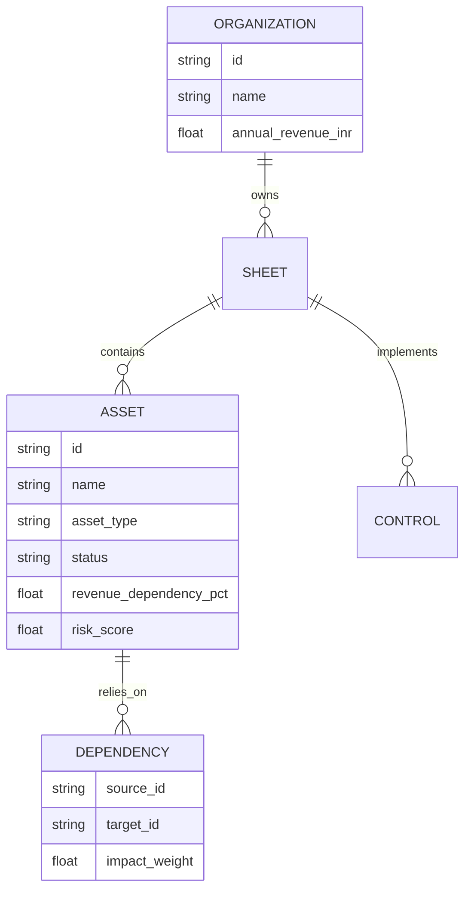
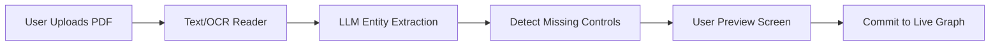

# Tarazu — AI-Powered Cyber Risk Quantification Platform

Tarazu is an advanced Cyber Risk Quantification and Simulation platform that bridges the gap between technical security metrics and business financial risk. It translates CVEs, missing controls, and architectural vulnerabilities into **Expected Annual Loss (EAL)** and **Return on Security Investment (ROSI)**.

> **"Do not invent losses. Calculate them from real architectural dependencies."**

---

## 📖 Overview

CISOs and Corporate Boards often speak fundamentally different languages. Security teams talk about patch SLAs and CVE criticality, while the Board talks about Revenue Exposure, Cost of Downtime, and Financial Risk. 

Tarazu solves this translation problem by analyzing your existing technical topology and computing precise, cascading financial impacts. It proves mathematically that a "Critical" vulnerability on a highly isolated backup server does not automatically equate to a massive financial loss, whereas a "Medium" vulnerability on a core transaction database might.

---

## ✨ Key Features

- **Multi-Organization Scaling:** Instantly switch between massive enterprises and tiny small businesses. The simulation engine and UI scale perfectly without breaking formatting or fabricating unrealistic losses.
- **Blast Radius (Impact Map):** A highly interactive 2D physics-based topology map visualizing how an outage cascades through upstream and downstream assets.
- **What-If Simulation Engine:** A rigorous mathematical simulator that clones the current state, applies changes (e.g., taking an asset offline), and returns the exact financial delta without double-counting shared dependencies.
- **AI Advisor Analytics:** Board-ready charts powered by Recharts, showcasing Risk Distributions and Financial Exposure concentrations.
- **Intelligent Document Processing:** Upload unstructured PDFs, SOC-2 reports, or Nmap scans to instantly extract missing controls and provision network assets.

---

## 📸 Product Walkthrough

### Global Dashboard & KPI Tracking

*The global view showing total Expected Annual Loss, risk distributions, and asset health across the entire organization.*

### AI Security Advisor (Analytics)

*Board-ready charts showing ROSI, Risk Distribution Shifts, and Top 5 Assets by Financial Impact.*

### What-If Scenario Simulator

*Run complex scenarios to see the exact financial delta if an asset goes offline, preventing fictional sequential loss stacking.*

### Intelligent Document Processing

*Extract assets and controls directly from uploaded PDFs and network scans.*

---

## 🏗️ Architecture

Tarazu operates on a decoupled modern architecture designed for real-time physics mapping and rapid risk calculation.



---

## 🧠 The What-If Simulation Engine

Most cyber risk simulators fail by falling into the trap of **Sequential Loss Stacking** (adding individual asset loss estimates together blindly). Tarazu's What-If engine prevents double-counting by utilizing a full state clone.



---

## 📊 Data & Entity Model

The engine is highly relational. A failure in a low-level network asset cascades upwards until it strikes a revenue-generating business process.



---

## 🔄 Document Ingestion Workflow



---

## 📚 Comprehensive Documentation

For a deep dive into the platform, please refer to our exhaustive documentation suite located in the `/docs` folder:

- 🌟 **[Master Context & Handoff](docs/PROJECT_CONTEXT.md)** *(Start here if you are a new developer or AI agent)*
- 📐 **[System Architecture](docs/architecture.md)**
- 🚀 **[Feature Breakdown](docs/features.md)**
- 🗄️ **[Data Model](docs/data-model.md)**
- 🧮 **[What-If Simulation Engine](docs/simulation-engine.md)**
- 📄 **[Intelligent Document Ingestion](docs/document-ingestion.md)**
- 📈 **[Analytics & Blast Radius](docs/analytics-and-impact.md)**
- 💻 **[Local Development Guide](docs/development-guide.md)**

---

## ⚙️ Setup & Running Locally

Ensure you have Node.js (v18+) and Python (3.9+) installed.

### 1. Start the FastAPI Backend
```bash
cd backend
pip install -r requirements.txt
python -m uvicorn app.main:app --reload
```
*API runs at `http://127.0.0.1:8000` (Swagger UI at `/docs`)*

### 2. Start the React Frontend
```bash
cd frontend
npm install
npm run dev
```
*UI runs at `http://localhost:5173`*

### 3. Generate Synthetic Data (Optional)
```bash
cd backend
python scripts/generate_synthetic_docs.py
```
*Creates realistic test documents in the `/synthetic-data/` folder.*

---

## 🏢 Synthetic Data & Organizations

Tarazu ships with realistic synthetic data designed for testing document ingestion and processing capabilities. You can find these assets in the `/synthetic-data/` folder at the root of the project.

The platform is seeded with three distinct organization profiles:
1. **Suraksha Finance:** A massive enterprise banking topology.
2. **Acme Corp:** A mid-market SaaS platform.
3. **FreshBites Local Bakery:** A tiny organization that proves the simulation engine scales *down* cleanly without breaking formatting or inventing unrealistic million-dollar losses for a missing Point-of-Sale machine.
