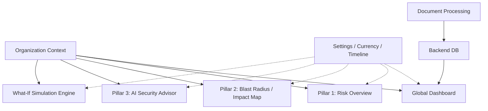
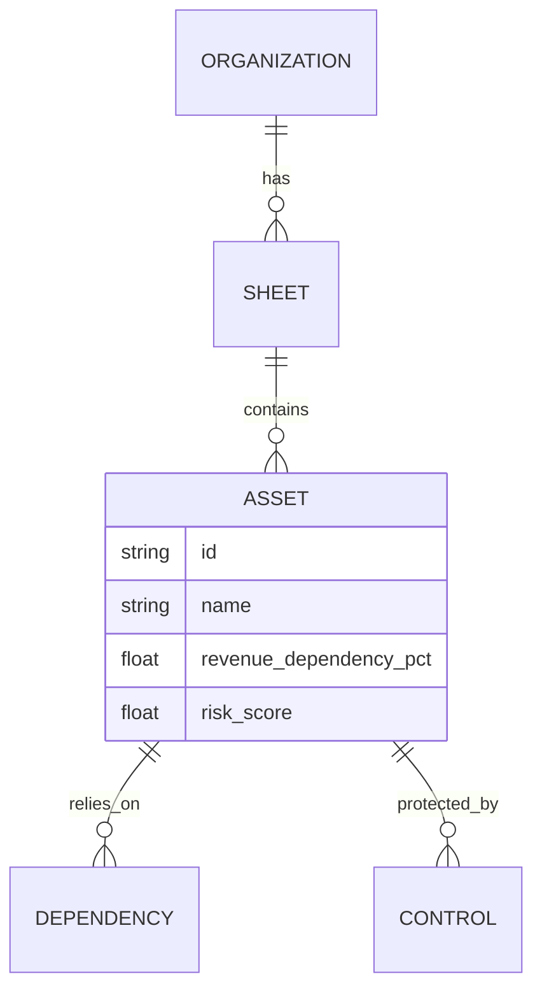
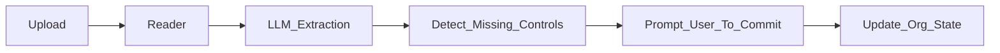

# Tarazu — AI-Powered Cyber Risk Quantification Platform
## Project Handoff & Context Document

Welcome to the **Tarazu Cyber Risk Quantification Platform**. This document is the **single-source-of-truth project handoff**. 

> **Important for AI Agents & New Developers:** 
> You should be able to read *only* this document and understand what this project is, why it exists, how it works, what has been implemented, how the major features interact, and where to make changes safely without breaking the simulation architecture.

---

## 1. Project Identity

- **Project Name:** Tarazu (Cyber Risk Quantifier)
- **Purpose:** To bridge the gap between technical cyber security metrics and business financial risk.
- **Problem Being Solved:** CISOs and Boards often speak different languages. Security teams talk about CVEs and patch SLAs, while the Board talks about Expected Annual Loss (EAL), Revenue Exposure, and Return on Security Investment (ROSI). Tarazu translates the former into the latter.
- **Product Philosophy:** "Do not invent losses. Calculate them." Financial impact must strictly flow from architectural dependencies (e.g., if a CCTV camera goes down, it doesn't cause a $10M loss unless it explicitly supports a revenue-generating business process).
- **High-level Workflow:** 
  1. Define Organization 
  2. Map Assets & Dependencies 
  3. Calculate Baseline Risk 
  4. Simulate Scenarios (What-If) 
  5. Generate Board-ready Analytics (Advisor).

---

## 2. Current Product Capabilities

1. **Multi-Organization Dashboards:** Users can toggle between massive enterprise architectures (Suraksha Finance) and tiny local businesses (FreshBites Bakery), instantly scaling the entire UI and math engine.
2. **Blast Radius (Impact Map):** A visual topology graph (Pillar 2) mapping how an outage in a database cascades into an outage in a payment gateway.
3. **What-If Scenario Engine:** An advanced simulator allowing users to modify assets (e.g., mark as offline) or toggle policies (e.g., enforce MFA) to see the exact resulting financial delta compared to the baseline.
4. **AI Advisor & Analytics:** Data-driven metrics using Recharts (Pillar 3) that plot Return on Security Investment (ROSI), Risk Distributions, and Financial Exposure concentrations.
5. **Intelligent Document Processing:** (Platform Modules) Allows ingesting SOC-2 reports or PDF security policies to automatically provision controls and assets.

---

## 3. Complete Feature Map



---

## 4. Architecture

- **Frontend:** React (TypeScript), Vite, TailwindCSS. State is managed locally via React hooks and context. Charts are rendered using `recharts`. Network graphs use `react-force-graph-2d`.
- **Backend:** Python, FastAPI. Contains the core logic for dependency resolution, financial risk calculation, and simulation. 
- **Persistence:** In-memory mock databases via `seed_data.py`. No persistent PostgreSQL is currently required, allowing rapid prototyping and stateless testing. 

---

## 5. Data Model



---

## 6. Organization Model

The application isolates data entirely by Organization.
- **Suraksha Finance:** Large enterprise, huge transaction volumes, complex multi-cloud topology.
- **Acme Corp:** Mid-market tech company.
- **FreshBites Local Bakery:** A tiny organization used to prove that the simulation engine scales *down* cleanly without breaking formatting or inventing unrealistic million-dollar losses for a missing POS machine.

Switching orgs in the UI immediately re-fetches all sheets, assets, and resets the simulation baseline.

---

## 7. Asset & Risk Model

Assets possess:
- `status`: 'healthy', 'warning', 'critical', 'offline'
- `revenue_dependency_pct`: The exact percentage of the organization's total revenue that flows through this asset.
- **Risk Score:** Computed based on vulnerabilities (CVEs), missing controls, and upstream dependencies.

---

## 8. Financial Model

- **Canonical Currency:** The backend performs all internal calculations in **INR** (Indian Rupees).
- **Presentation:** The frontend reads the `Currency` from user settings and applies conversion rates (e.g., INR to USD) just before rendering, using `formatMoney`. 
- **Critical Rule:** Asset criticality **does not** automatically imply financial loss. A highly critical isolated backup server going offline creates operational risk, but zero immediate direct financial loss unless dependencies connect it to a revenue stream.

---

## 9. Simulation Model (The "What-If" Engine)

This is the most complex and important part of the codebase.

```text
Baseline State
       ↓
Clone Database (Temporary State)
       ↓
Apply Scenario Changes (e.g., CCTV = Offline, Firewall = Bypassed)
       ↓
Recalculate entire dependency tree (to catch cascading failures)
       ↓
Recalculate Asset Risk Scores
       ↓
Recalculate Financial Relationships
       ↓
Compare Final Simulated State vs Baseline State
       ↓
Return Delta
```

**Crucial Lesson Learned:** We originally built the simulator by taking individual changes and "adding up" their isolated losses. This caused massive double-counting when shared downstream dependencies failed. **Do NOT revert to sequential loss stacking.** The engine must apply all changes to a temporary state, run the standard calculation engine once, and diff the result.

---

## 10. Document Ingestion

Users can upload documents in the "Platform Modules" tab.



---

## 11. Synthetic Data

The repository contains a `/synthetic-data/` folder at the root. 
- It houses PDFs, CSVs, and TXT files for the organizations.
- These files represent real-world artifacts (SOC-2 reports, Nmap scans) that a user would typically ingest into the Tarazu platform.

---

## 12. Non-Negotiable Implementation Rules

1. **Do not fake functionality.** UI controls must connect to real backend logic.
2. **Timeline must change real calculations.** 
3. **Currency must perform actual conversion.** Use `formatMoney` everywhere monetary values exist.
4. **Financial impact must be relationship-driven.** Do not invent a $5M loss just because an asset fails. 
5. **Do not double-count simulation impacts.** Rely on the `recalculate_all_risks()` function on the cloned state.
6. **Zero change is valid.** If a user simulates taking a CCTV offline at a bakery, the financial exposure delta is $0.
7. **Positive/negative wording must match the mathematical delta.** (e.g., Exposure *Decreased* by $X). 
8. **Keep user-facing terminology simple.** Do not use "OCR" or "Parse Pipeline" in the UI. Use "Document Reading" and "Data Processing".
9. **Preserve existing functionality** when modifying the project.

---

## 13. File & Directory Map

```text
SIH_26105/
├── backend/
│   ├── app/
│   │   ├── api/          # FastAPI Routes (whatif.py, telemetry.py, etc.)
│   │   ├── services/     # Core Business Logic (risk_engine.py, seed_data.py)
│   │   └── main.py       # App entrypoint
│   └── scripts/          # Synthetic data generators
├── frontend/
│   ├── src/
│   │   ├── components/   # React components organized by feature
│   │   ├── services/     # API fetch clients
│   │   ├── utils/        # Formatters, Animation variants
│   │   └── App.tsx       # Main router and layout
├── synthetic-data/       # Test files for ingestion
└── docs/                 # Documentation (You are here)
```

---

## 14. Instructions for the Next AI Agent

If you are an AI coding agent assigned to this repository:
1. **Read this file first.** 
2. **Inspect the existing implementation before changing anything.** Do not assume how the Risk Engine works. Look at `backend/app/services/risk_engine.py`.
3. **Preserve existing features.** 
4. **Follow the data and simulation models.** Do not fabricate statistics or invent financial relationships.
5. **Keep organizations isolated.**
6. **Update documentation** if you change the architecture.
7. **Run the application** (`npm run build` and `python -m uvicorn app.main:app`) after implementation changes to guarantee no regressions.

You are trusted to uphold the integrity of the Tarazu platform. Good luck!
