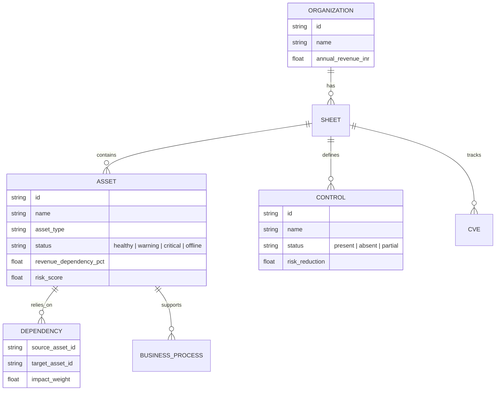

# Data Model

The data model for Tarazu is heavily relational, focusing on connecting abstract IT assets to concrete financial and operational dependencies.

## Entity Relationship Diagram

## Entities Explained

- **Organization:** The highest level container. Stores total financial boundaries (e.g., Annual Revenue).
- **Sheet:** A logical grouping of assets, often mapped to a specific department, architecture, or business unit (e.g., "Payment Infrastructure" or "Corporate Network").
- **Asset:** Any node in the network. This can be a physical server, a cloud database, an API gateway, or a CCTV camera.
  - Crucially, `revenue_dependency_pct` defines the maximum theoretical percentage of the organization's total revenue that is directly dependent on this single asset functioning correctly.
- **Dependency:** A directional edge. If Asset A relies on Asset B, a failure in B cascades a percentage of its impact into A based on the `impact_weight`.
- **Control:** Security measures (e.g., MFA, Encryption). Their presence mitigates the baseline vulnerability of the assets they protect.
- **CVE:** Known vulnerabilities attached to assets that natively increase their risk score.
