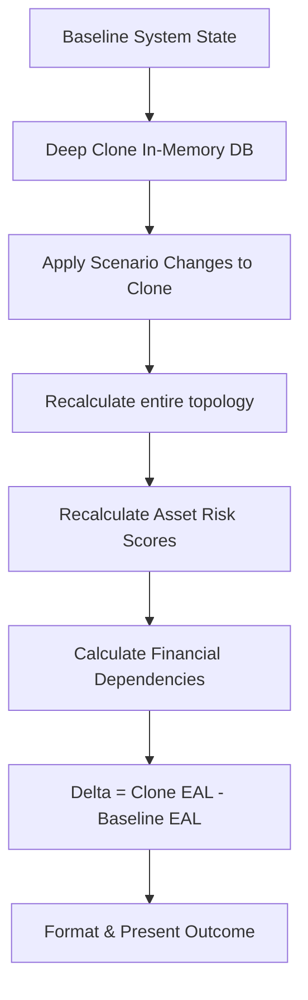

# What-If Simulation Engine

The What-If Simulation Engine is the core differentiator of the Tarazu platform. It answers the question: *"What happens to my system/business if I change this situation?"*

## The Mathematical Challenge

Historically, cyber risk simulators fall into a trap known as **Sequential Loss Stacking**. 
If taking Asset A offline costs $100, and taking Asset B offline costs $100, simulators often add these together to say taking both offline costs $200.

However, if both Asset A and Asset B are just different paths to the same Database C, taking both down might actually only cost $100 total, because the downstream failure is shared. 

Tarazu explicitly prevents double-counting by utilizing a full state clone.

## Simulation Lifecycle

## How Changes are Applied

When a user selects a scenario (Single Asset or Multiple Asset):
1. The backend copies the current live state of the organization.
2. It loops through all requested `ScenarioChange` items.
   - Example 1: `{"change_type": "status", "target_id": "cctv-01", "value_str": "offline"}`
   - Example 2: `{"change_type": "control_toggle", "target_id": "mfa-ctrl", "value_str": "present"}`
3. The engine modifies the cloned models.
4. **`recalculate_all_risks()`** is triggered. This forces the graph to trace all edges. If the CCTV goes offline, it flags as critical. But because CCTV has no edges connecting it to the POS transaction flow, its financial consequence evaluates to $0.
5. The final Expected Annual Loss (EAL) of the clone is compared against the EAL of the original.

## Zero Change Handling

If an operational asset goes down but it has no revenue dependencies (e.g., a Bakery's CCTV or an HR Wiki), the mathematical delta will return `0`. 
The frontend correctly interprets this and displays: **"No Change in Exposure"**. It explicitly prevents rendering *"Exposure Increased by $0"*.

## Positive/Negative Wording

- `Delta < 0`: This means the Clone's EAL is lower than the Baseline. The risk has gone down. The UI will render: **"Exposure Decreased by $X"**.
- `Delta > 0`: This means the Clone's EAL is higher. Risk has gone up. The UI will render: **"Exposure Increased by $X"**.

The monetary magnitude is strictly wrapped in `Math.abs()` to prevent mathematically confusing statements like *"Increased by $-100"*.
